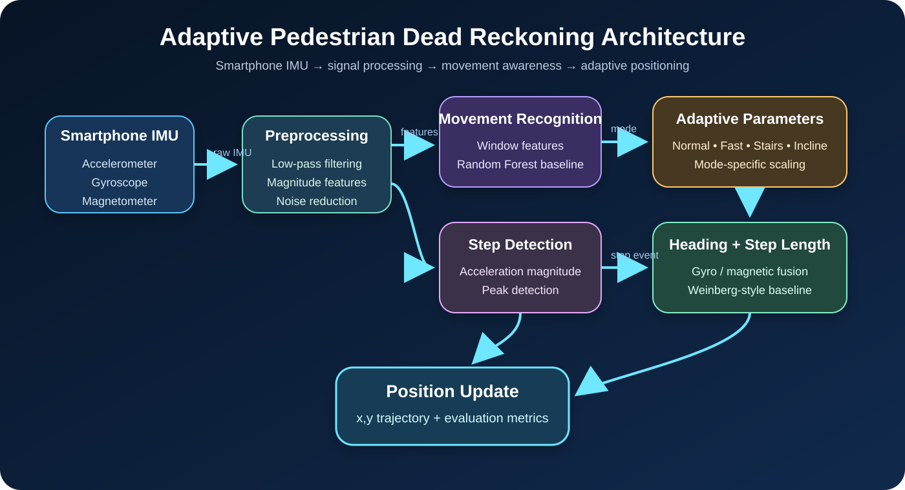
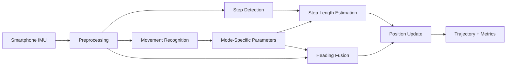
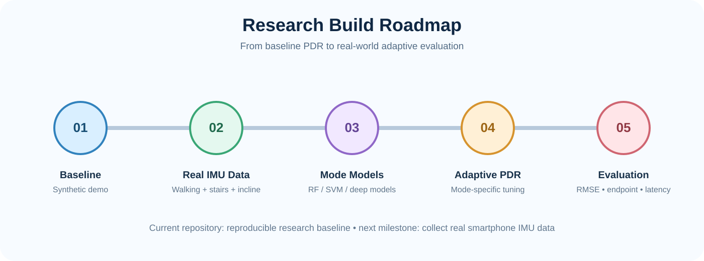

# Adaptive Pedestrian Dead Reckoning (PDR)

<p align="center">
  <strong>A reproducible, mode-aware indoor positioning research baseline built from smartphone IMU signals.</strong>
</p>

<p align="center">
  <a href="https://github.com/Akashperla/adaptive-pdr-research/actions/workflows/ci.yml"></a>
  
  
  
  
</p>

<p align="center">
  <a href="https://colab.research.google.com/github/Akashperla/adaptive-pdr-research/blob/main/notebooks/quick_demo.ipynb">
    
  </a>
</p>

---

## What this project is building

This repository implements a research-oriented **Adaptive Pedestrian Dead Reckoning** pipeline for estimating pedestrian position when GPS is weak or unavailable.

The system uses smartphone inertial measurements from:

- **Accelerometer** — movement and step dynamics
- **Gyroscope** — rotational motion and short-term heading change
- **Magnetometer** — absolute directional reference

The core research idea is to move beyond a fixed PDR configuration. The pipeline recognizes coarse movement modes and uses them to adjust positioning parameters during the walk.

> **Current status:** the reproducible software baseline is implemented. Real-world smartphone data collection, subject-level validation, and final research claims are still future experimental stages.

## System architecture

<p align="center">
  
</p>

### Processing pipeline



## Research components

| Component | Current baseline | Purpose |
|---|---|---|
| Signal preprocessing | Butterworth low-pass filtering | Reduce high-frequency sensor noise |
| Step detection | Acceleration magnitude + peak detection | Identify pedestrian step events |
| Movement recognition | Window features + Random Forest | Estimate normal / fast / stairs / incline modes |
| Step length | Weinberg-style amplitude model | Convert step events into distance |
| Heading | Tilt-compensated magnetometer + gyro complementary fusion | Estimate walking direction |
| Adaptation | Mode-specific parameter scaling | Modify PDR behavior by movement mode |
| Evaluation | Endpoint error, trajectory RMSE, mean error | Quantify positioning performance |

<details>
<summary><strong>Why these algorithms?</strong></summary>

The original research concept defines the high-level modules but does not fully specify every low-level implementation choice. This repository therefore uses practical, reproducible baseline methods that can later be replaced experimentally.

The intention is to create a controlled starting point for comparisons such as:

- Random Forest vs SVM vs 1D-CNN/LSTM movement recognition
- complementary heading fusion vs Madgwick/Mahony/EKF
- fixed vs personalized vs learned step-length estimation
- static PDR vs mode-aware adaptive PDR
- basic filtering vs wavelet/EMD decomposition

</details>

## Interactive demo

The fastest way to explore the project is the notebook:

**[`notebooks/quick_demo.ipynb`](notebooks/quick_demo.ipynb)**

It can be opened directly in Google Colab using the badge at the top of this README. The notebook:

1. clones the repository,
2. installs dependencies,
3. generates synthetic IMU data,
4. trains the movement-classification baseline,
5. runs the Adaptive PDR engine,
6. displays metrics and the resulting trajectory.

## Local quick start

```bash
git clone https://github.com/Akashperla/adaptive-pdr-research.git
cd adaptive-pdr-research

python -m venv .venv
source .venv/bin/activate      # Windows: .venv\Scripts\activate

pip install -r requirements.txt
python scripts/run_demo.py
```

Generated outputs are written to `outputs/`:

```text
outputs/
├── synthetic_imu.csv
├── processed_imu.csv
├── movement_model.joblib
├── trajectory.csv
├── trajectory_plot.png
└── metrics.json
```

## Data format

A real smartphone dataset should contain the following columns.

| Column | Description | Default unit |
|---|---|---|
| `timestamp` | sample time | seconds |
| `ax`, `ay`, `az` | acceleration | m/s² |
| `gx`, `gy`, `gz` | angular velocity | rad/s |
| `mx`, `my`, `mz` | magnetic field | µT |
| `label` | optional activity class | categorical |
| `gt_x`, `gt_y` | optional ground-truth position | meters |

Required columns:

```text
timestamp, ax, ay, az, gx, gy, gz, mx, my, mz
```

Optional supervised/evaluation columns:

```text
label, gt_x, gt_y
```

## Repository map

```text
adaptive-pdr-research/
├── .github/workflows/
│   └── ci.yml                    # automated tests + demo
├── docs/
│   ├── architecture.svg          # visual system architecture
│   └── research-roadmap.svg      # project roadmap
├── notebooks/
│   └── quick_demo.ipynb          # interactive Colab entry point
├── scripts/
│   └── run_demo.py               # end-to-end synthetic demo
├── src/pdr/
│   ├── activity.py               # movement classifier
│   ├── adaptive.py               # mode-specific parameters
│   ├── config.py                 # YAML configuration
│   ├── engine.py                 # complete Adaptive PDR engine
│   ├── evaluation.py             # trajectory metrics
│   ├── features.py               # time-window feature extraction
│   ├── heading.py                # heading estimation + fusion
│   ├── io.py                     # dataset loading/validation
│   ├── preprocessing.py          # signal filtering
│   ├── simulate.py               # synthetic IMU generator
│   ├── step_detection.py         # peak-based step detection
│   └── step_length.py            # distance estimation
├── tests/
│   └── test_core.py
├── config.yaml
├── requirements.txt
└── README.md
```

## Research roadmap

<p align="center">
  
</p>

### Current milestones

- [x] Modular PDR software architecture
- [x] IMU preprocessing baseline
- [x] Step detection baseline
- [x] Step-length baseline
- [x] Gyroscope/magnetometer heading fusion
- [x] Movement-mode classification baseline
- [x] Mode-aware Adaptive PDR engine
- [x] Synthetic end-to-end demo
- [x] Automated CI testing
- [x] Interactive Colab notebook
- [ ] Collect real smartphone IMU sessions
- [ ] Build ground-truth indoor routes
- [ ] Evaluate multiple subjects and phone placements
- [ ] Compare baseline vs adaptive PDR
- [ ] Compare ML activity classifiers
- [ ] Run ablation studies
- [ ] Report latency and computational cost
- [ ] Finalize figures, tables, and research paper

## Planned experiments

<details>
<summary><strong>Experiment A — Baseline vs Adaptive PDR</strong></summary>

Use identical IMU recordings and compare a fixed-parameter PDR pipeline against movement-aware parameter adaptation.

Primary metrics:

- trajectory RMSE
- endpoint position error
- mean position error
- heading error
- step count error

</details>

<details>
<summary><strong>Experiment B — Movement classifier comparison</strong></summary>

Compare Random Forest, SVM, and sequence/deep-learning models using subject-independent evaluation where the dataset permits it.

Primary metrics:

- accuracy
- macro F1
- per-class precision/recall
- confusion matrix
- inference latency

</details>

<details>
<summary><strong>Experiment C — Robustness</strong></summary>

Evaluate the pipeline under different phone placements, walking speeds, turns, stairs, inclines, and magnetic conditions.

The goal is to identify not only where the system works, but where assumptions break.

</details>

## Reproducibility

The repository is intentionally configuration-driven. Core thresholds and model parameters are stored in [`config.yaml`](config.yaml), allowing experiments to be repeated without modifying implementation code.

GitHub Actions automatically runs:

- the test suite on Python 3.10, 3.11, and 3.12,
- the synthetic research demo,
- artifact generation for trajectory outputs.

## Research integrity

This repository distinguishes between **implemented baselines** and **validated research conclusions**.

No accuracy improvement should be claimed until real experimental data and ground truth are collected and evaluated. Synthetic data is included to verify the software pipeline, not to establish real-world PDR performance.

## Technology

`Python` · `NumPy` · `Pandas` · `SciPy` · `scikit-learn` · `Matplotlib` · `PyYAML` · `GitHub Actions` · `Jupyter/Colab`

## Next milestone

The next major step is **real smartphone IMU data collection** with synchronized movement labels and ground-truth routes. That dataset will enable the first meaningful comparison between fixed-parameter and adaptive PDR.

---

<p align="center">
  <strong>Research build in progress: sensors → movement understanding → adaptive indoor positioning.</strong>
</p>
